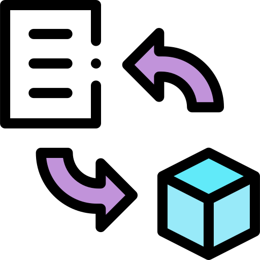
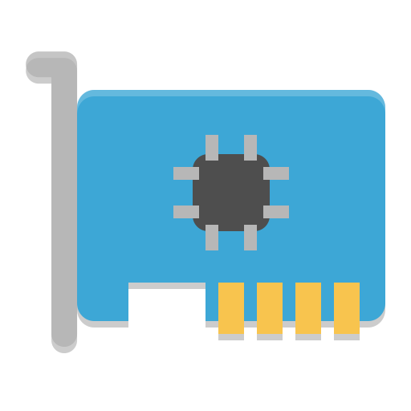

## Towards CPU-free datamovement in the cloud

  In my current work, I'm exploring new hardware and software technologies to enable <strong>fast</strong>, <strong>reliable</strong>, <strong>low-overhead</strong>, and <strong>secure</strong> communication in datacenters. I'm working towards designing of completely CPU-free cloud networking stacks, where the entire cross-machine application-to-application data path <em>runs outside of the processor, with zero software overhead and CPU utilization</em>. 

My general philosophy here is that datacenter processors should not waste their time and energy for data exchange, especially at 400 Gbps and beyond. This is particularly important in the today's world of fine-granular, highly-concurrent, and interactive internet services, especially the ones based on the pay-as-you-go cost model. CPU-free communication stacks will dramatically reduce the total amount of CPU time required per application, and will also enable truly nano-second scale cloud networking. Just imagine your microservices where there is almost no difference in calling remote vs local functions. Physically, this is already possible today with all the advances in datacenter optical wiring and <a href="https://www.microsoft.com/en-us/research/project/sirius/" title="MSRC">switching</a>. We just needs to sort out the bottlenecks in the end-host, so here we go!
{:.note title="Philosophy"}

In addition to this main research direction, I recently started working (in collaboration with <a href="https://www.microsoft.com/en-us/research/group/azure-for-operators-afo-research/" title="MSRC">Microsoft Azure for Operators</a>) on cloud native 5G architectures and virtual radio access networks (vRAN). I'm still very new to this field, but I'm looking forward to the opportunities that 5G and vRAN open for low-latency communication and real-time in-network processing.

---

## Projects

##### <ins>Dagger: CPU-Free End-Host RPC Stack</ins>

In this project, we built the first proof-of-concept system for offloading a basic cloud RPC stack to cache-coherent FPGAs. Our FPGA-based SmartNIC runs the end-to-end RPC datapath in hardware, and communicates ready-to-use user-level objects **directly with the application memory** at low latency and high CPU efficiency. The latter is achieved via tight integration of the FPGA with the host processor over a NUMA interconnect. This essentially enables the shared-memory model of communication between applications and hardware, therefore bypassing the OS kernel, device drivers, and any other software layers. **Advisors**: <a href="https://www.csl.cornell.edu/~zhiruz/" title="Cornell">Professor Zhiru Zhang</a> and <a href="https://www.csl.cornell.edu/~delimitrou/" title="Cornell">Professor Christina Delimitrou</a>.

<a href="https://github.com/barabanshek/Dagger" title="MSRC">GitHub repo</a>

<a href="https://github.com/barabanshek/Dagger/blob/master/resources/Dagger_Slides.pdf" title="MSRC">Project Presentation (long)</a>

<a href="https://www.youtube.com/watch?v=ONnR6Mg6t4E" title="MSRC">ASPLOS'21 Conference Talk, 2021</a>

<a href="https://dl.acm.org/doi/abs/10.1145/3445814.3446696" title="MSRC">ASPLOS'21 Paper, 2021</a>

<a href="https://ieeexplore.ieee.org/document/9180035/" title="MSRC">IEEE CAL Early Work Paper, 2020</a>

##### <ins>Towards Virtual Radio Access Networks (vRAN) as Cloud Native Feature</ins>

5G networks come with great bandwidth and low latency, therefore enabling many emerging applications such as self-driving cars, drone swarms, IoT, cloud gaming, and so on at the large scale. However, in order to take the full advantage of their potential, networking functions for 5G and beyond must be scalable, reliable, and intelligently adaptable. This research aims to develop novel technologies to address the aforementioned requirements and enhance the widespread adoption of radio access networks. In particular, we further extend the concept of vRAN to introduce fault tolerance, disaggregation, and load balancing when deploying 5G network functions on the edge cloud platforms at scale.

This work is a collaborative effort with <a href="https://www.microsoft.com/en-us/research/group/azure-for-operators-afo-research/" title="MSRC">Microsoft Azure for Operators Research</a> group at Microsoft.

**Mentor:** <a href="http://anujkalia.com/" title="AnujKalia">Anuj Kalia</a>.

<a href="https://www.microsoft.com/en-us/research/publication/resilient-baseband-processing-in-virtualized-rans-with-slingshot/" title="MSRC">5G PHY resilience paper, 2023 [Microsoft Research Preprint]</a>

##### <ins>Dagger+: CPU-Free, General and Efficient Data Transformation and Movement System for the Cloud</ins>

Extension of our first work on Dagger which in addition to the data movement offload also enables data transformation and manipulation offloads. In this project, we account for the lessons learnt from the first Dagger work and are focusing on making a new CPU-free datamovement system which is not only efficient/fast, but also general, highly programmable, and backward compatible with existing systems. We leverage the novel architectural extensions in the upcoming server-class processors to make it possible! 

The project is sponsored and guided by <a href="https://www.intel.com/content/www/us/en/research/overview.html" title="Intel">Intel Labs</a>.

##### <ins>Building Fast and Efficient NICs for Modern Cloud</ins>

The network bandwidth is growing: 400 Gbps already today, xTbps coming soon. Cloud processors themselves already contain hundreds of cores and are ready to consume it. However, their memory and I/O subsystems are not. The inefficiencies in the traditional hardware packet I/O showing up at such speeds limit the full potential of high bandwidth networks and the demands of today's applications.

The upcoming (as of 2022) server-class x86/64 processors will come with optimized I/O sub-system through a set of new ISA extensions and new interconnects such as CXL. In this research, we evaluate the new I/O system on commodity and kernel-bypass end-host networking stacks, and estimate its potential to improve the performance and CPU efficiency of cloud networking.

The project is sponsored and guided by <a href="https://www.intel.com/content/www/us/en/research/overview.html" title="Intel">Intel Labs</a>.
