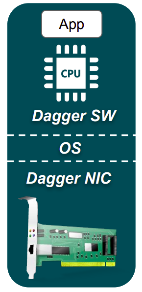

## Towards CPU-free datamovement in the cloud

  In my current work, I am exploring new hardware and software technologies to enable <strong>fast</strong>, <strong>reliable</strong>, <strong>low-overhead</strong>, and <strong>secure</strong> communication in datacenters. I am working towards designing of completely CPU-free cloud networking stacks, where the entire cross-machine application-to-application data path <em>runs outside of the processor, with zero software overhead and CPU utilization</em>. 

My general philosophy here is that datacenter processors should not waste their time and energy for data exchange. This is particularly important in the today's world of fine-granular, highly-concurrent, and interactive internet services, especially the ones based on the pay-as-you-go cost model. CPU-free communication stacks will dramatically reduce the total amount of CPU time required per application, and will also enable truly nano-second scale cloud networking. Just imagine your microservices where there is almost no difference in calling remote vs local functions. Physically, this is already possible today with all the advances in datacenter optical wiring and <a href="https://www.microsoft.com/en-us/research/project/sirius/" title="MSRC">switching</a>. We just needs to sort out the bottlenecks in the end-host, so here we go!
{:.note title="Philosophy"}

In addition to this main research direction, I recently started working (in collaboration with <a href="https://www.microsoft.com/en-us/research/group/azure-for-operators-afo-research/" title="MSRC">Microsoft Research Azure for Operators</a>) on 5G and virtual radio access networks (vRAN). I am still very new to this field, but I am looking forward to the opportunities that 5G and vRAN open for low-latency communication and real-time in-network processing.

---

## Projects

##### <ins>Dagger: CPU-Free End-Host RPC Stack</ins>

In this project, we built the first proof-of-work system for offloading a basic cloud RPC stack to cache-coherent FPGAs. Our FPGA-based SmartNIC runs the end-to-end RPC datapath in hardware, and communicates ready-to-use user-level objects **directly with the application memory** at low latency and high CPU efficiency. The latter is achieved via tight integration of the FPGA with the host processor over a NUMA interconnect. This essentially enables the shared-memory model of communication between applications and hardware, therefore bypassing the OS kernel, device drivers, and any other software layers.

<a href="https://www.youtube.com/watch?v=ONnR6Mg6t4E" title="MSRC">ASPLOS'21 Conference Talk, 2021</a>

<a href="https://dl.acm.org/doi/abs/10.1145/3445814.3446696" title="MSRC">ASPLOS'21 Paper, 2021</a>

<a href="https://ieeexplore.ieee.org/document/9180035/" title="MSRC">IEEE CAL Early Work Paper, 2020</a>

##### <ins>Efficient End-Host Networking with I/O-Optimized x86/64 ISA Extension</ins>

The upcoming (as of 2021) server-class x86/64 processors will come with the optimized I/O sub-system through a set of new ISA extensions. In this research, we evaluate the new I/O system on commodity and kernel-bypass end-host networking stacks, and estimate its potential to improve the performance and CPU efficiency of cloud networking. This project is being carried over with the generous support by <a href="https://www.intel.com/" title="Intel">Intel Corporation</a>.

<##### <ins>Cloud Native Architecture for Virtual 5G RAN</ins>>

