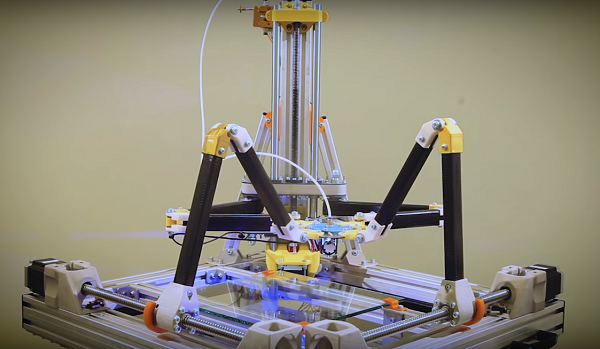

In the past, I was involved in some decent number of projects both in the industry and academia, as well as hobby projects. Here, I'm listing the most interesting of them.

## Industry 

---

##### <ins>Honeycomb: CPU-free Cloud Datastore System</ins>

Fork of the <a href="https://www.microsoft.com/en-us/research/project/farm/" title="MSRC">Microsoft FaRM</a> project, where we had been working on designing a CPU-free datastore architecture (implemented entirely in hardware, on an FPGA) for the applications in distributed graph databases and low-latency key-value stores. **Project manager**: <a href="https://www.linkedin.com/in/aleksandar-dragojevic-909469a/">Aleksandar Dragojevic</a>.

Implementation of a fast micro-second scale reliable networking stack on an FPGA.
{:.note title="My contribution"}

<a href="https://www.microsoft.com/en-us/research/project/honeycomb/" title="MSRC">Project page</a>

##### <ins>Android ART: Java Runtime and Compiler</ins>

R&D project around optimization of the Android ART (Android Runtime) for performance and memory footprint. The project scope included compiler (both AOT and JIT) and runtime optimizations such as application memory snapshotting, vectorization, fast class booting, etc. **Project manager**: <a href="https://www.linkedin.com/in/ivan-maidanski-271a4a22/">Ivan Maidanski</a>.

Implementation of loop transformations, optimization of the runtime hash table for Java strings, optimization of Java class loading with static analysis of class references, and all sorts of bug fix and production support.
{:.note title="My contribution"}

Samsung R&D Above and Beyond Award
{:.note title="Awards"}

## Academia 

---

##### <ins>Low-Latency Realtime PID Controller for Lasers</ins>

Design and implementation of a low-latency realtime PID controller for lasers for the research in <a href="https://www.microsoft.com/en-us/research/project/farm/" title="MSRC">Laboratory for Quantum Gases</a> at EPFL. **Advisor**: <a href="https://people.epfl.ch/jean-philippe.brantut">Professor Jean-Philippe Brantut</a>.

Mixed signal PCB design with high-speed, high-precision ADCs/DACs, FPGA programming, fabrication, and testing.
{:.note title="My contribution"}

##### <ins>A System For Realtime Diagnosis of Rotating Machines</ins>

The main purpose of this project is making a system capable of realtime diagnostics of rotating machines by using a single sensor: an optical encoder. The system consists of a realtime FPGA-based unit for recording and pre-processing data from the sensor, and the machine-learning part running offline for data analysis.

Creating the concept of the project, implementation of the first FPGA-based prototype.
{:.note title="My contribution"}

<a href="https://elibrary.ru/item.asp?id=24933545" title="Paper">Reference Publication</a>

## Hobby Projects 

---

##### <ins>3D Printer with Non-Cartesian Kinematics</ins>

Development of a robot with the new non-cartesian kinematics for 3D printing. The main novelty of this work is the support-less kinematic scheme where stability of the structure is achieved via coordinated operation of the actuators. This project started as independent hobby work with my school friend, and turned into our join undergraduate thesis.

Development of the robot control system, and its implementation in the on-board firmware.
{:.note title="My contribution"}

<a href="https://www.youtube.com/watch?v=p9RoNIMCmE0&t=2s" title="Robot">School press release</a>
